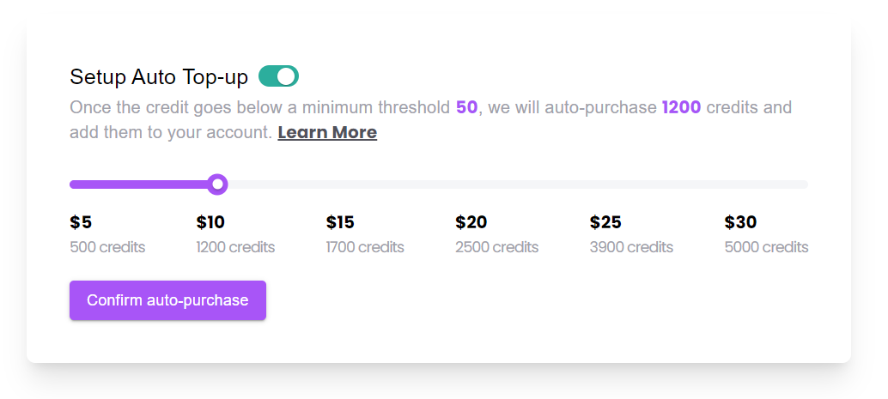

# Auto Top-up React Component

This React component enables setting up auto top-up functionality for a credit system. Users can toggle auto top-up, select a credit amount using a slider, and confirm the auto-purchase of credits.

## Table of Contents

- [Installation](#installation)
- [Usage](#usage)
- [Example](#example)

## Installation

To use the `AutoTopUp` component in your project, follow these steps:

1. Clone the repository:

   ```bash
   git clone https://github.com/satish-kumar75/Custom-Slider.git
   ```

2. Install the dependancy:

   ```bash
   npm install
   ```

3. Run the server

   ```bash
   npm start
   ```

4. Go to the `localhost:3000` to see the output

## Example

```bash
    import React from 'react';
import AutoTopUp from './AutoTopUp';

function App() {
  return (
    <div className="App">
      <AutoTopUp />
    </div>
  );
}

export default App;
```
